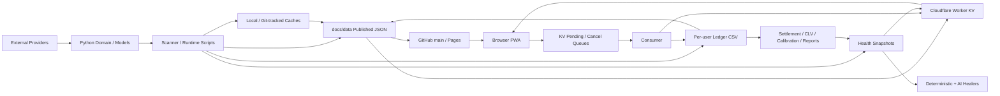
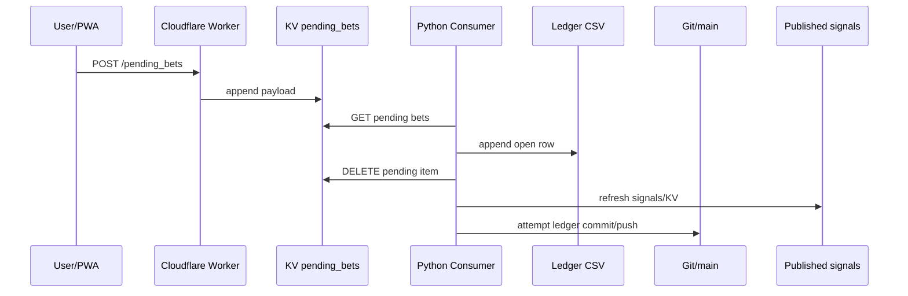

# SportsBrain — Canonical System Map

**Snapshot:** 2026-08-13, 23:09 Europe/Berlin  
**Production/runtime-data HEAD inspected:** `e1d81da102f8d629e71836c3b8b3d284987fe8b3` (`main`)  
**P0-A candidate overlay inspected separately:** `f2f7831fdaead6667b6eb53c0021a7bc0377eebf` (`p0/p0a-corrections`, PR #10, **not production**)  
**Document role:** CEO architecture map / system-boundary reference  
**Repository mutation by CEO:** None. This document was produced from read-only inspection.

---

## 0. Reading rules

This map intentionally separates three kinds of reality.

| Label | Meaning |
|---|---|
| **PROD** | Code and committed state on `main` at the snapshot SHA above. |
| **P0-A OVERLAY** | Candidate changes on PR #10. They must not be treated as production until final review, merge, post-merge CI, deployment and public verification. |
| **RUNTIME** | Local Mac / launchd / Cloudflare live state. Runtime facts can differ from repository state and need independent verification. Historical runtime evidence is not silently promoted to “current”. |
| **TARGET** | CEO-required architecture/invariant that may not yet exist. |

A central rule for every future SportsBrain discussion:

> **Source release truth, runtime/data HEAD, Cloudflare state and browser-visible truth are different objects. Never infer one from another without evidence.**

---

# 1. Executive architecture

SportsBrain is not one linear pipeline. It is a **hybrid distributed system** spanning:

1. External sports, odds, player and result providers.
2. Python domain/model code.
3. Scanner and maintenance scripts.
4. GitHub Actions.
5. A local macOS/launchd runtime.
6. Git-tracked runtime/data artifacts.
7. Cloudflare Worker + KV.
8. GitHub Pages / static PWA.
9. Browser-local state.
10. Reporting/calibration/measurement jobs.
11. Monitoring and autonomous recovery logic.

The architecture has several strong local “truth owners”, but a major maturity issue is that those truths are not yet universally mandatory at every boundary.

Examples of good local authority:
- `data/cache/odds_state.json` is designed as the sole writer authority for **refreshed odds**.
- `TennisEventState` separates **schedule truth** from **event lifecycle truth**.
- the fixture registry stabilizes Tennis identity across cross-midnight/reschedule changes.
- model metadata has a `gate_passed` concept.
- per-user ledger CSVs are the primary P&L record.

Examples where the authority is not yet globally enforced:
- production `main` PWA contains alternative model-tip betting paths.
- production Worker accepts client-defined betting semantics.
- Tennis odds refresh maps many non-H2H markets to H2H-B.
- historical sport/league identity is incomplete.
- Health status can be caller-asserted rather than derived from actual execution truth.
- `main` simultaneously carries source and frequent runtime-data commits.

---

# 2. Deployment zones and trust boundaries

## 2.1 External provider zone

### Football
Observed provider families include:
- TheOddsAPI
- Betfair
- OddsPortal
- football results/statistical data sources
- Football-specific caches and fallback layers.

### Tennis
Observed provider/fallback families include:
- TheOddsAPI discovery/events/odds
- Betfair
- Pinnacle
- OddsPortal
- TennisExplorer
- WebSearch
- implied/model-derived odds (display/fallback only by design)
- ESPN for authoritative live/completion evidence
- historical Elo / Sackmann-like match history
- TennisAbstract-style aggregate serve stats / bios and other feature data.

**Trust principle:** provider existence does not imply equal authority. Provider authority must be scoped by *concept*: fixture existence, initial schedule, updated schedule, LIVE status, result, current odds, etc.

---

# 3. Core code domains

## 3.1 `src/config.py` — global policy/config layer

Production main currently defines or contributes:
- betting thresholds
- Kelly fraction
- minimum edge
- stake minima/maxima
- active-bet limits
- bankroll start
- user defaults
- league registry
- Tennis category modes
- sport/category-specific operating flags.

### Important production fact
At the inspected `main`, `MAX_ACTIVE_BETS = 5`, while CEO governance requires **3**.  
P0-A changes this to 3, but that is not production yet.

### Architectural risk
`config.py` mixes:
- domain policy,
- user/runtime preferences,
- rollout switches,
- governance-like controls.

Long term, CEO hard invariants should be distinguishable from ordinary tuning parameters. A user/runtime override should never be able to silently override a hard safety invariant.

---

## 3.2 Betting core — `src/betting/`

Primary responsibilities include:
- ledger persistence
- gates / thresholds
- Kelly/stake calculation
- sport/market value detection
- settlement helpers
- database synchronization.

### Primary persistent financial record
Per-user CSV:
`results/ledger_<user>.csv`

Legacy:
`results/ledger.csv`

The production ledger currently performs migration/default behavior, including a universal blank-league fallback to `wm2026`, which is unsafe for ambiguous or Tennis rows.

### SQLite
The ledger synchronizes to SQLite as a secondary representation.

**Critical architecture rule:**
> CSV and SQLite are two representations of the same logical ledger and must have schema/semantic parity.

Production main does not yet contain the P0-A identity extensions consistently.

---

# 4. Signal architecture

## 4.1 Scan-time signal

Scanners produce a logical signal with immutable or mostly immutable scan-time fields such as:
- sport
- match
- market
- kickoff
- model probability
- scan odds
- scan EV
- stake recommendation
- confidence
- tournament/category metadata.

A signal should not become actionable solely because these scan-time fields exist.

## 4.2 Signal ID

Production `make_signal_id()` uses:
- sport
- match
- market
- kickoff date.

Tennis can instead obtain stable IDs through the Tennis fixture registry.

### Desired semantic
A `signal_id` identifies **one betting proposition**, not merely a match.

It must be:
- deterministic enough for refresh/republication,
- collision-resistant across genuinely different events,
- stable across legitimate scheduling changes.

---

# 5. Refreshed odds architecture

## 5.1 Canonical local authority

`src/signals/signal_status.py` explicitly defines:

> `data/cache/odds_state.json` is the single authority for refreshed odds.

Writer:
- odds refresher.

Readers:
- dashboard/publication layer.
- status computation / later publication.

Keyed by:
- `signal_id`.

Stored concepts:
- `initial_odds`
- `initial_ev_pct`
- `current_odds`
- `current_ev_pct`
- `odds_ts`
- `odds_source`
- `odds_fetch_tier`
- `signal_status`
- `odds_history`

This is one of SportsBrain's strongest architectural patterns.

## 5.2 Signal lifecycle

Production statuses:
- `ACTIVE`
- `EDGE_LOST`
- `STALE_ODDS`
- `STARTED`
- `EXPIRED`
- `UNREFRESHABLE`

Production hard stale threshold:
- 30 minutes.

## 5.3 Football refresh

Production refresher maps individual football markets to explicit fields in the provider quote.

This is the correct design pattern:
> **market-specific probability proposition ↔ market-specific current quote**

## 5.4 Tennis refresh — known semantic defect

Production `_refresh_tennis()` effectively uses:

- `home` / one specific A handicap → H2H-A
- most other Tennis markets → H2H-B

Therefore:
- totals,
- first set,
- alternate handicap,
- other side markets

can receive a **Match Winner B quote rather than the corresponding market quote**.

This seam is a high-severity Data/Actionability risk and must remain in the invariant registry until corrected and regression-tested.

---

# 6. Tennis identity and event truth

## 6.1 Tennis fixture registry

Storage:
`data/cache/tennis_fixture_registry.json`

Purpose:
- stable fixture/signal identity across schedule changes and midnight boundaries.

Current conceptual key:
- normalized sport key
- canonical order-independent player pair
- market for signal registry entry.

### Strength
Solves concrete cross-midnight/reschedule instability.

### Remaining risk
No guaranteed event-instance namespace for:
- year
- season
- round
- draw
- repeat meeting in same tournament
- qualification vs main draw.

Target:
provider-native stable event ID where available, with robust fallback identity.

---

## 6.2 TennisEventState

Storage:
`data/cache/tennis_event_states.json`

Canonical lifecycle states:
- `UPCOMING`
- `AWAITING_START`
- `DELAYED`
- `LIVE`
- `COMPLETED`
- `POSTPONED`
- `CANCELLED`
- `UNKNOWN`

### Fundamental invariant
> **Elapsed clock time never creates LIVE.**

LIVE requires authoritative evidence.

### Schedule truth and lifecycle truth are separate

Schedule fields:
- initial scheduled start — immutable after authoritative creation
- current scheduled start — mutable under source-authority rules.

Lifecycle:
- status changes based on qualified evidence.

This separation is architecturally correct and should be copied into other domains.

---

# 7. Tennis model pipeline

## 7.1 Elo

Provides:
- overall rating
- surface rating
- known-player/history gates.

Unknown player behavior can degrade/fail rather than pretending high certainty.

## 7.2 Tennis LGBM

Model storage:
`models/tennis_lgbm/`

Artifacts:
- model
- calibrator
- feature order
- metadata.

Production ensemble loads the LGBM only when metadata says `gate_passed`.

### Strong principle
> A persisted model is not automatically a production-approved model.

## 7.3 Live serving path mismatch

In `predict_winner_ensemble()`, live feature building uses a newly created:

`RollingState()`

for both AB and BA feature construction.

Historical training/holdout uses chronological historical state.

Therefore features related to:
- recent form
- surface form
- H2H
- rest
- fatigue
- historical rolling performance

can have a different live distribution from the training/holdout distribution.

**Interpretation:**
Historical holdout improvement is evidence that the historical feature path works. It is not yet proof that the exact live-serving distribution is equally valid.

---

# 8. Football model / scanner layer

SportsBrain has multiple Football contexts:
- WM / tournament-era tooling
- Bundesliga 2
- Dixon-Coles
- Elo
- LGBM
- stacker/ensemble
- scorer / special-market probability layers
- squad/injury/xG data.

Primary architecture pattern:
1. build fixture/data universe
2. compute model probabilities
3. apply gates
4. compare against odds
5. create signal/recommendation
6. publish
7. optionally place/log through explicit user path.

The core architectural requirement is that **model-tip visualizations must never silently become canonical Value Bets unless backed by the same canonical signal contract**.

Production main currently violates this principle in at least one UI family.

---

# 9. PWA architecture

Static frontend:
`docs/`

Primary areas:
- `docs/js/views.js`
- `docs/js/bets.js`
- published `docs/data/*.json`

## 9.1 Data sources

Browser reads:
- static published data
- Cloudflare `/signals.json`
- live-score JSONs
- user/session/token/localStorage state.

## 9.2 Multiple product surfaces

Observed UI concepts:
- Home / recommendations
- Football signals/model tips
- Tennis signals
- match detail
- open bets
- live bets
- settled/history
- model explanations
- bankroll / betting modal.

## 9.3 Production problem: alternative value semantics

Production `views.js::predCard()` computes EV directly from model probability + displayed odds and assigns:
- `source=value` when EV >= 3%
- otherwise `manual`.

This is an **independent actionability path** outside the refreshed canonical signal lifecycle.

This is exactly the type of duplicated business rule the invariant registry is intended to eliminate.

## 9.4 Deep link path

Production `bets.js` can synthesize a button from `_signals`, carrying scan-time attributes into the modal.

Every synthetic or convenience path must obey the same canonical contract as visible signal cards.

---

# 10. Cloudflare Worker architecture

Worker responsibilities include:
- public/read signal snapshot
- authenticated signal snapshot writes
- per-user token routing
- pending bet queue
- cancel request queue
- push subscriptions
- invite/token management
- GitHub workflow dispatch / healer dispatch.

## 10.1 KV namespaces / logical keys

Important keys/prefixes:
- `signals_json`
- `signals_json_<user>`
- `pending_bets`
- `pending_bets_<user>`
- `cancel_requests`
- `cancel_requests_<user>`
- `user_tokens`
- `invites`
- `push_subs`
- healer cooldown state.

## 10.2 User-routing behavior

Default user:
`philip`

Per-user signal snapshot fallback:
if a requested per-user snapshot does not exist, Worker can serve the default user's snapshot.

This is convenient for backward compatibility but is a **privacy/isolation risk** for a future multi-user/public product.

## 10.3 Production pending-bet boundary

Production main validates:
- match shape
- market syntax
- odds range
- stake absolute range 0.5–25.

But production main does **not** enforce:
- authoritative bankroll 5% cap
- max three active bets
- canonical signal lookup
- canonical current odds
- canonical signal status/freshness
- explicit strict source identity.

It normalizes any non-manual source to `value`.

This is a major P0-A target.

---

# 11. Bet placement flow — production main

### Production weaknesses
- client-defined semantics reach Worker
- Worker cap is absolute €25, not 5% bankroll
- Consumer writes `stake_pct=0.0`
- consumer may coerce unknown source to `value`
- Queue item is deleted before durable remote Git persistence
- Git push failure is non-fatal
- cancel request lifecycle is also not transactional.

P0-A substantially redesigns this flow, but final queue durability is still under CEO review.

---

# 12. Cancellation flow — production main

1. PWA sends cancel request.
2. Worker removes matching pending item if still pending.
3. Worker queues `cancel_requests`.
4. Python consumer calls `cancel_bet()`.
5. Consumer deletes cancel-request queue after local cancellation.
6. Durable remote persistence is not transactionally tied to the ACK.

Target:
> Cancellation must obey the same durable mutation/ACK invariant as placement.

---

# 13. Ledger architecture

## 13.1 Canonical financial concepts
A ledger row should ultimately carry:
- stable bet identity
- sport
- league/tour
- fixture/event identity
- market
- selection
- entry odds
- stake EUR
- stake %
- bankroll at placement
- source
- signal provenance
- model probability
- status
- P&L
- closing odds
- CLV
- timestamps.

Production main lacks several of these explicit fields.

P0-A adds many of them as candidate changes.

## 13.2 Per-user persistence

`results/ledger_<user>.csv`

is also used to derive:
- current bankroll
- open bets
- settled bets
- reports/calibration.

Therefore ledger corruption propagates broadly.

---

# 14. Settlement and closing odds

Major jobs/scripts include:
- football settlement
- Tennis settlement
- historical settlement/backfill
- closing odds
- Tennis closing odds
- CLV monitoring
- season/session reports.

Conceptual flow:

`open ledger row`
→ result evidence
→ settled state
→ P&L
→ closing odds
→ CLV
→ model/strategy measurement.

**Important:** settlement correctness and closing-odds correctness are separate invariants.

---

# 15. Measurement and calibration

Primary report:
`scripts/generate_season_report.py`

Production tier definition currently:
- `source=value` + not Challenger → production
- `source=manual` → manual
- Challenger → shadow.

### Known contamination risk
Historically, `source=value` did not prove that a bet came through the canonical production signal path.

### Tennis classification risk
`_is_tennis_row()` infers Tennis from:
- market tokens
- source containing tennis
- league in atp/wta/challenger.

Generic Tennis Match Winner `home/away` with source `value` and blank/wrong league can be misclassified.

Target:
> New measurement must classify from explicit immutable provenance, not market-name inference.

---

# 16. Health and monitoring architecture

## 16.1 Job-level snapshots

Writer:
`src/monitoring/health_writer.py`

Storage:
`results/health/<job>.json`

Concepts:
- status
- timestamp
- exit code
- source
- fallback
- metadata.

### Problem
Caller supplies `status` and `exit_code` independently.

No universal internal invariant currently forces:
`exit_code != 0 => status != ok`.

## 16.2 Aggregate health

`src/monitoring/aggregate_health.py`

Combines:
- job status
- expected cadence
- artifact freshness.

Current outcome:
- `ok`
- `degraded`
- `down`.

Current artifact freshness checks are narrow:
- signals data
- live scores.

## 16.3 Outcome checks

`src/monitoring/outcome_checks.py` adds a better second layer:
- stuck open bets
- stale signals
- dead/expired push delivery
- settle ran but no progress.

This is a good direction because it asks:
> “Did the expected product outcome happen?”

rather than only:
> “Did the cron execute?”

But it still does not yet cover the full Production Trust invariant set.

---

# 17. Self-healing architecture

## 17.1 Deterministic healer
Outcome symptoms can trigger deterministic actions such as:
- rerun settle
- re-consume
- force-refresh signals
- push diagnostics.

This can be acceptable if tightly scoped and idempotent.

## 17.2 AI healer

`scripts/auto_heal_ai.py`

can:
1. inspect health/logs
2. ask Anthropic/Claude for a fix
3. modify a file under `scripts/`
4. run pytest
5. commit
6. invoke `_git_safe_push.sh`.

This is a **real autonomous source-writer architecture**, even if the current runtime environment may not always provide the API key.

Target governance decision:
- diagnosis: allowed
- deterministic safe retry: allowed under policy
- autonomous source mutation/commit/push: should require explicit controlled Builder/Review governance.

---

# 18. CI and release architecture

## 18.1 Production main CI

Current `ci_gates.yml` on `main`:
1. compile source/scripts
2. narrow Core Smoke suite
3. Ruff regression check.

P0-A candidate adds Node Worker contract tests.

## 18.2 `require_green_ci.py`

Strong concept:
- exact SHA must have green CI, or
- for path-excluded runtime/data HEAD, HEAD must be a descendant of last green main source SHA.

This introduces an important distinction:

### Source Release SHA
The most recent source-changing SHA with relevant green CI.

### Runtime/Data HEAD
The newest Git commit, often an automated data-only commit.

These must be explicit in monitoring and publication.

---

# 19. Git as both source and runtime datastore

SportsBrain uses Git for:
- source control
- model/source artifacts
- public Pages files
- health artifacts
- ledger persistence
- runtime Tennis/live data.

Benefits:
- auditability
- simple persistence
- easy Pages publication
- history.

Costs:
- `main` moves very frequently
- source and runtime changes share history
- branches become behind main quickly
- mergeability can be misleading
- exact source release provenance becomes harder
- push/rebase collisions become operational risk
- sensitive ledger data can become public.

This is one of the most important system-level design constraints.

---

# 20. Persistence map

| Concept | Primary/Intended authority | Replicas / derived forms | Main writer(s) | Risk |
|---|---|---|---|---|
| Source code | Git source release | local checkout | Builder + controlled bots | Runtime commits obscure source SHA |
| Runtime/data HEAD | Git `main` | local checkout | bots/workflows | Not equal to source release |
| Refreshed odds | `data/cache/odds_state.json` | `docs/data/signals.json`, Cloudflare KV, PWA | odds refresher | Tennis market mapping bug |
| Tennis event state | `data/cache/tennis_event_states.json` | schedule/signals/live views | Tennis state reducer | identity/source authority |
| Tennis fixture identity | fixture registry | signals, live lookup | registry updater | cross-year/repeat collision |
| Signal snapshot | published signals JSON | Cloudflare KV, PWA | dashboard writer | multiple inputs / stale publication |
| Ledger | per-user CSV | SQLite, published open/settled, reports | scanner/consumer/settlers | public data, schema/provenance |
| Pending bet | Cloudflare KV | PWA pending UI | Worker | ACK durability |
| Cancel request | Cloudflare KV | none | Worker | ACK durability |
| Bankroll | derived from ledger | published `bankroll_state` | dashboard publisher | snapshot freshness |
| Open-bet count | derived from ledger | published open_bets | dashboard publisher | snapshot freshness |
| Health | per-job JSON | aggregate, signals KV/PWA | job workflows | caller truth vs execution truth |
| Closing odds | ledger/closing artifacts | CLV reports | closing odds jobs | coverage + semantic market match |
| Model | model artifacts + metadata | live predictor | trainer | train/live feature parity |
| User token | Cloudflare KV | browser storage | Worker | isolation / browser security |

---

# 21. Writer matrix

A concept is safer when there is exactly one canonical writer or tightly governed writer family.

| Object | Writers observed | Desired writer model |
|---|---|---|
| `odds_state.json` | Odds refresher | **Single writer — keep** |
| Tennis event state | Tennis reducer/state pipeline | Single reducer — keep |
| Tennis fixture registry | registry helper | Single logical registry writer |
| Ledger | scanners, consumer, settlement/cancel flows | Controlled mutation API / transaction model |
| signals JSON | dashboard publication from multiple jobs | One publisher API, many callers |
| Cloudflare signals KV | backend publisher, authenticated POST | One trusted backend identity per user |
| pending_bets KV | Worker | Single writer boundary |
| cancel_requests KV | Worker | Single writer boundary |
| health job file | each job | schema + derived truth |
| aggregate health | aggregator | Single aggregate writer |
| source code | Builder + currently AI-healer possibility | Human/controlled Builder only |
| runtime Git data | multiple workflows/bots | path-scoped writers with conflict policy |

---

# 22. Replication and freshness topology

Important propagation paths:

### Refreshed odds
provider
→ refresher
→ odds sidecar
→ dashboard republish
→ docs/data/signals.json
→ Cloudflare signals KV
→ PWA.

### Ledger mutation
scanner/consumer/settler
→ per-user ledger CSV
→ Git durable persistence
→ dashboard-derived bankroll/open/settled
→ Cloudflare KV
→ PWA.

### Tennis LIVE
provider evidence
→ Tennis event/live reducer
→ local/public live score JSON
→ Git runtime commit
→ PWA live rendering.

### Health
job execution
→ results/health job file
→ aggregate
→ docs/data/health or signal payload
→ Cloudflare
→ PWA/healer.

Every arrow introduces:
- latency
- failure possibility
- stale-state possibility
- semantic conversion possibility.

Monitoring must therefore validate **end-state semantics**, not only writer success.

---

# 23. High-risk seams

## S1 — Browser → Worker
Production client can currently define too much Value-Bet meaning.

## S2 — Worker → Pending KV → Consumer
Queue durability and retry classification are transactional concerns.

## S3 — Consumer → Ledger → Git
Local write is not equivalent to durable remote persistence.

## S4 — Ledger → Bankroll snapshot
Risk state is derived and replicated; stale snapshots must fail safe without causing permanent deadlock.

## S5 — Signal → odds refresher
Market identity must select the exact corresponding quote.

## S6 — Tennis event state → signal actionability
Pre-match, delayed, live and terminal semantics must be consistent in all languages/layers.

## S7 — Fixture registry → recurring event
Stable identity can become collision identity if namespace is too weak.

## S8 — Model training → live serving
Feature distributions must match or be explicitly modeled as different.

## S9 — Ledger provenance → measurement
`source=value` alone is insufficient historical proof of canonical production.

## S10 — Health writer → aggregate
Execution truth must not depend on an optimistic caller label.

## S11 — Git source → runtime HEAD
Data commits must never be interpreted as new source releases.

## S12 — Auto-healer → source code
Recovery automation must not bypass Builder/review governance.

## S13 — Public repo → personal ledger
Persistence architecture and privacy architecture are currently coupled.

---

# 24. P0-A overlay — candidate architecture, not production

PR #10 aims to add:
- canonical Value-Bet contract
- authoritative Worker signal lookup
- strict `source=value|manual`
- current odds + freshness gates
- EV ceiling
- sport-aware Tennis event-state rules
- authoritative bankroll/open-bet risk state
- 5% cap at multiple boundaries
- max 3 active bets
- explicit bet identity fields
- model probability unit normalization
- SQLite parity improvements
- Node Worker contract tests in CI
- risk heartbeat
- improved placement queue durability.

### Still open under CEO final review
The final reviewed candidate still required:
1. proof of **remote** durability even when nothing is staged locally
2. permanent reject vs retryable infrastructure failure
3. cancellation queue under the same durable ACK invariant
4. actual Playwright/browser verification rather than only Node pure-function tests.

Therefore:

> **Do not copy P0-A branch behavior into the PROD columns of any CEO artifact yet.**

---

# 25. Monitoring target — Production Trust layer

A future Production Trust monitor should combine:

## Execution truth
- did jobs run?
- did they exit successfully?
- are cadence expectations accurate?

## Data truth
- are required artifacts fresh?
- do replicas agree?
- is schema valid?

## Betting truth
- every actionable Value signal has canonical provenance
- current odds are market-correct and fresh
- EV within bounds
- bankroll cap respected
- active-bet limit respected
- no stale/live/terminal Value action.

## Tennis truth
- LIVE requires evidence
- event state consistent
- fixture identity unambiguous
- open Tennis bets visible to correct monitor.

## Release truth
- current source release SHA known
- source release CI green
- runtime/data HEAD separately known
- public build generated from expected release.

## Privacy truth
- no personal financial/betting data accidentally public.

Outcome should be explicit:
- `HEALTHY`
- `DEGRADED`
- `UNSAFE`

A merely stale dashboard may be DEGRADED.
A Value Bet violating a bankroll/current-odds invariant is UNSAFE.

---

# 26. Architecture principles to make permanent

1. **One concept → one canonical owner.**
2. **Replicas are never authorities.**
3. **Client data is request intent, not financial/security truth.**
4. **No queue ACK before durable side effect.**
5. **Retryable infrastructure failure is not permanent business rejection.**
6. **Market identity and quote identity are inseparable.**
7. **Schedule truth and lifecycle truth are separate.**
8. **Time alone cannot assert LIVE.**
9. **Model artifact existence is not model approval.**
10. **Production population requires provenance, not inference.**
11. **Source release SHA and runtime/data HEAD are separate.**
12. **Health must describe product truth, not merely cron activity.**
13. **Fail closed at money/actionability boundaries.**
14. **Fail degraded — not silently wrong — at informational boundaries.**
15. **User identity must never silently fall back to another user's private state in a commercial architecture.**
16. **Autonomous recovery may retry deterministic operations; source mutation requires controlled Builder governance.**
17. **Every hard invariant needs an enforcement point, deterministic test and production monitor.**
18. **A score increase requires production evidence, not branch code.**

---

# 27. Open architecture questions requiring later explicit decisions

These are not silently resolved by this document.

1. What becomes the long-term durable financial datastore if personal ledgers leave the public Git repo?
2. Should Git remain a runtime-data store after privacy migration?
3. What exact provider-native ID becomes primary Tennis fixture identity?
4. How should repeated same-player/same-tournament fixtures be namespaced?
5. What is the canonical taxonomy for sport/league/tour/category?
6. What is the canonical market taxonomy shared by model, odds, signal, Worker and ledger?
7. Should current bankroll mean equity including staked capital, free bankroll, or another formal accounting definition? It must be documented once.
8. Which event statuses are valid for Football once Football gets canonical event-state data?
9. How should delayed/postponed events re-enter actionability if new authoritative schedule/odds arrive?
10. What is the long-term replacement for historical `source=value` measurement classification?
11. Should cancellation and placement use an outbox/transaction-log pattern rather than Git as queue-backed persistence?
12. Which health checks are hard `UNSAFE` vs `DEGRADED`?
13. Should real browser smoke become a required release gate?
14. What is the formal rollback unit: source release, Worker deploy, Pages build, data schema, or all separately?
15. What exact powers remain for `auto_heal_ai.py`?

---

# 28. CEO interpretation

SportsBrain's architecture is **not fundamentally chaotic**. It contains several good patterns:
- authority sidecars
- explicit state machines
- provider hierarchy
- gate metadata
- per-user snapshots
- fail-closed CI guard concepts.

The current maturity problem is **semantic federation**:

> Good local truths exist, but the system has not yet forced every path to consume the same truth.

The highest-value architectural work is therefore not adding more models or more UI. It is turning local truths into **system-wide contracts**.

That is what the accompanying Invariant Registry formalizes.

---

# 29. Evidence index

Primary files inspected for this map:

- `src/config.py`
- `src/betting/ledger.py`
- `src/notifications/web_dashboard.py`
- `src/signals/signal_status.py`
- `src/signals/odds_refresher.py`
- `src/tennis/event_state.py`
- `src/tennis/fixture_registry.py`
- `src/tennis/ensemble.py`
- `src/models/tennis_lgbm.py`
- `scripts/tennis_scan.py`
- `cloudflare/worker.js`
- `docs/js/views.js`
- `docs/js/bets.js`
- `scripts/consume_pending_bets.py`
- `scripts/generate_season_report.py`
- `src/monitoring/health_writer.py`
- `src/monitoring/aggregate_health.py`
- `src/monitoring/outcome_checks.py`
- `scripts/auto_heal_ai.py`
- `.github/workflows/ci_gates.yml`
- `scripts/require_green_ci.py`
- `docs/legal.html`
- `.github/workflows/*`
- `src/tennis/odds/*`

**Snapshot discipline:** exact implementations can change after this timestamp; future CEO work must re-check changed source rather than treating this file as a substitute for current repository reality.
